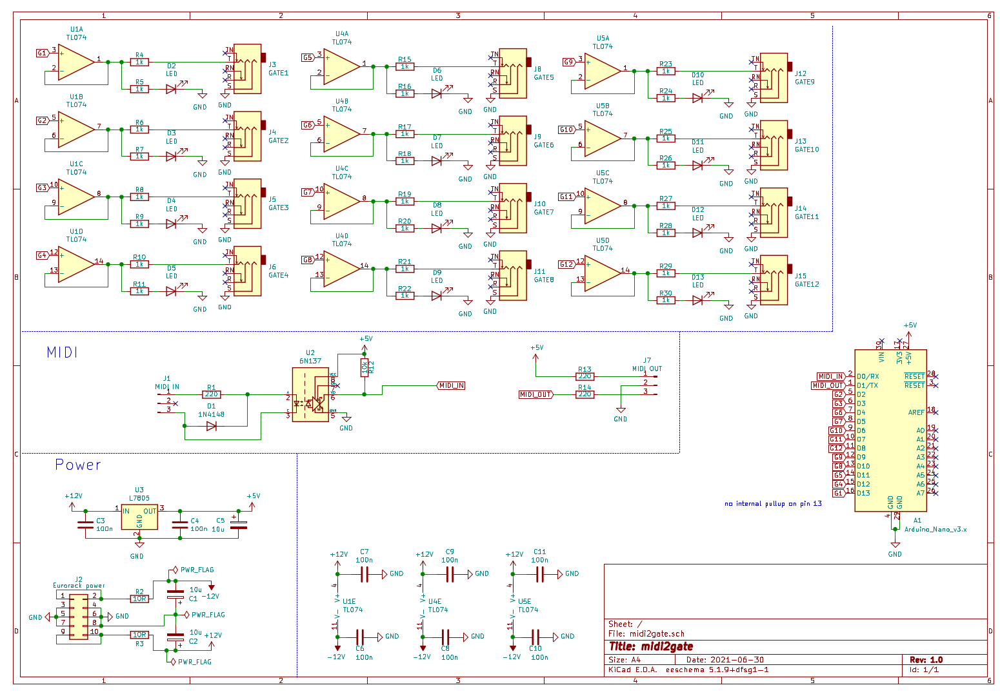

Simple Midi to gate module with 12 gates.

  
  

## How to get it

Download the [lates release](https://github.com/sebastianbeyer/SO_midi2gate/releases/latest)
including the gerber files and Arduino code

## Arduino code

The code can be found in the code directory and requires only a
[midi library](https://github.com/FortySevenEffects/arduino_midi_library).
Install instructions for this lib can be found
[in the repo](https://github.com/FortySevenEffects/arduino_midi_library#getting-started).

## Schematic

## BOM

| Reference| Quantity | Value | Description |
| -------- | -------- | ----- | ----------- |
| C1, C2, C5 |        3 | 10u   | EL cap      |
| C3, C4, C6, C7, C8, C9, C10, C11 | 8 |100n | ceramic disc cap |
| D1 | 1 | 1N4148 | diode |
| D2, D3, D4, D5, D6, D7, D8, D9, D10, D11, D12, D13 | 12 | LED | |
| J1, J2 | 2 | MIDI jacks | |
| J1, J2 | 2 | Molex 3pin  | for MIDI jacks |
| J3, ... J15 |12 | Large jack sockets | |
| R1, R13, R14 | 3 | 220 | |
| R2, R3 | 2 | 10R | |
| R4, R5, R6, R7, R8, R9, R10, R11, R15, R16, R17, R18, R19, R20, R21, R22, R23, R24, R25, R26, R27, R28, R29, R30 | 24 |1k | |
| R12 | 1 | 10k |  |
| U1, U4, U5 | 3 | TL074 | opamp |
| U2 | 1 | 6N137 | optocoupler for midi |
| U3 | 1 | L7805 | 5V regulator |
| ?  | 1 |  Arduino Nano | |
